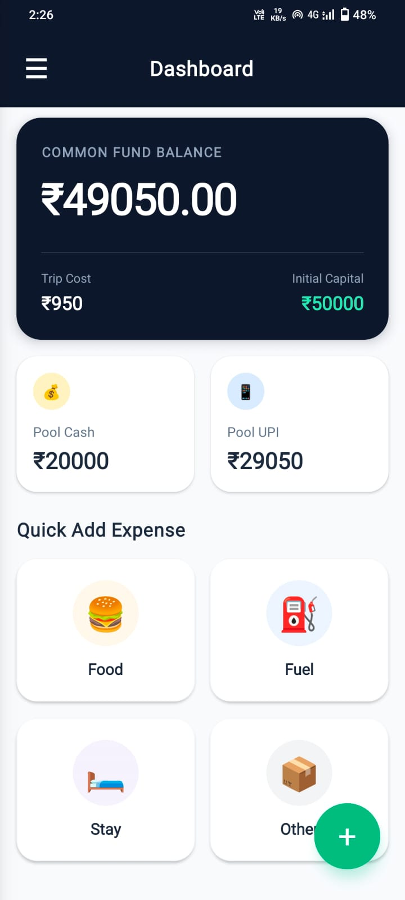
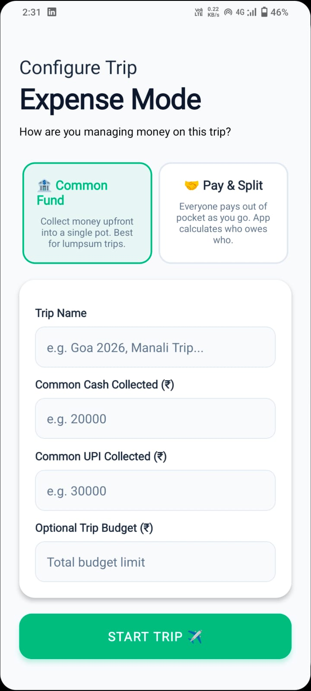
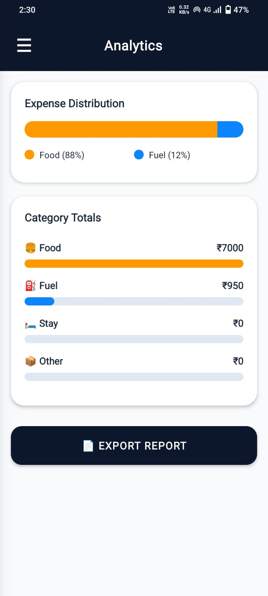
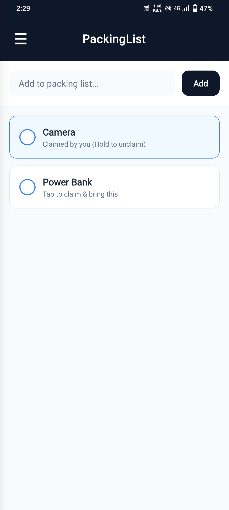
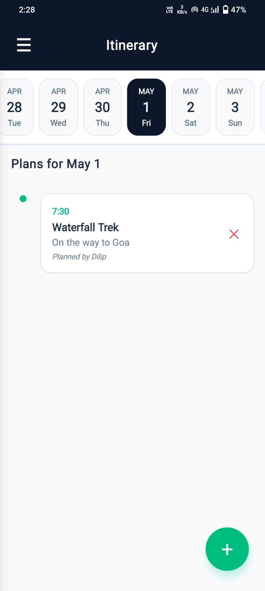
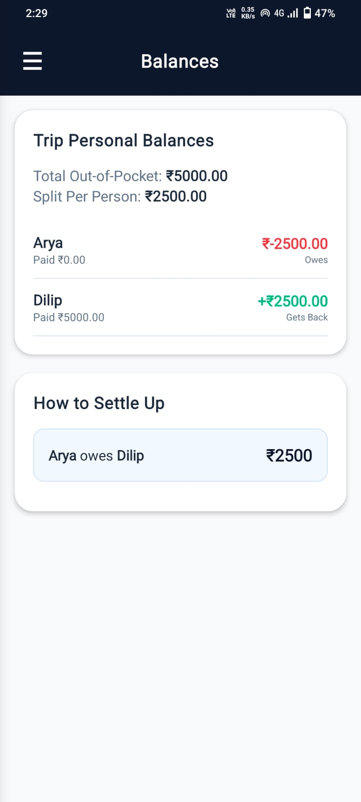
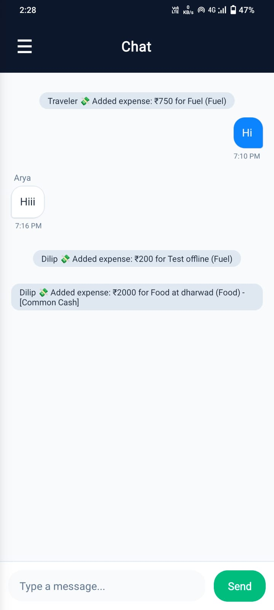
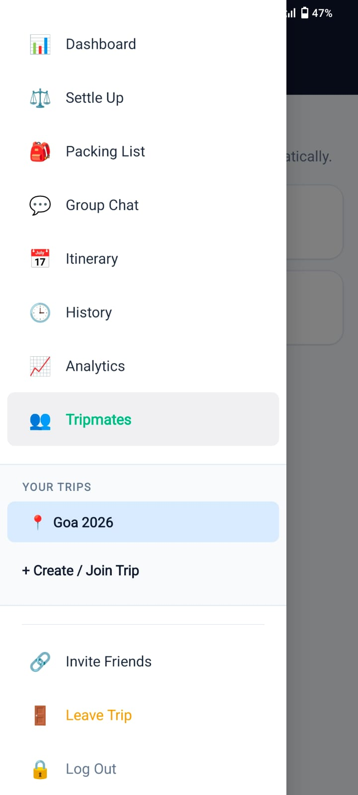

# ✈️ Trip Tracker

A modern mobile trip management and tracking application built using React Native and Expo. TripTracker helps users organize trips, monitor travel activities, and manage travel-related information through a clean and intuitive mobile interface.

Trip Tracker helps groups and solo travelers manage:
- 💸 Expenses
- 📊 Analytics
- 🧳 Packing Lists
- 🗓️ Itineraries
- 👥 Trip Members
- 🤝 Expense Splitting
- ☁️ Real-time Syncing

Designed with a modern UI and real-time collaboration features for smooth trip planning and management.

---

## 🚀 Features

### 💰 Smart Expense Tracking
- Add and manage travel expenses
- Categorized expense management
- UPI / Cash expense modes
- Personal & shared expense tracking
- Real-time balance calculations

### 👥 Group Expense Splitting
- Split expenses among trip members
- Track who paid and who owes
- Personal and group expense modes
- Automatic expense summaries

### 📊 Analytics Dashboard
- Expense distribution visualization
- Category-wise spending insights
- Bar graph analytics
- Export trip reports

### 🗓️ Trip Itinerary Planner
- Day-wise planning system
- Timeline-style itinerary UI
- Add activities with date & time
- Collaborative itinerary planning

### 🧳 Smart Packing List
- Shared packing checklist
- Claim items among members
- Mark items as packed
- Real-time synced updates

### ☁️ Firebase Integration
- Real-time cloud syncing
- Authentication support
- Live collaboration
- Persistent trip data storage

### 🎨 Modern Mobile UI
- Beautiful dark-themed interface
- Smooth animations
- Responsive layouts
- Optimized for Android devices

---

## 🛠️ Tech Stack

- React Native
- Expo
- Firebase Firestore
- Firebase Authentication
- JavaScript
- AsyncStorage
- React Native Components

---

## 📂 Project Structure

```plaintext
TripTracker
│── assets
│   └── screenshots
│       ├── Analytics.jpg
│       ├── Chat.jpg
│       ├── Dashboard.jpg
│       ├── ExpenseMode.jpg
│       ├── HamburgerMenu.jpg
│       ├── Itenerary.jpg
│       ├── PackingList.jpg
│       ├── PersonalSplit.jpg
│       └── TripMates.jpg
│
│── App.js
│── app.json
│── eas.json
│── index.js
│── package.json
│── package-lock.json
│── .gitignore
│── README.md
```

---

# 📸 Screenshots

## 🏠 Dashboard

<p align="center">
  
</p>

---

## 💸 Expense Management

<p align="center">
  
</p>

---

## 👥 Trip Mates

<p align="center">
  
</p>

---

## 📊 Analytics

<p align="center">
  
</p>

---

## 🧳 Packing List

<p align="center">
  
</p>

---

## 🗓️ Itinerary Planner

<p align="center">
  
</p>

---

## 🤝 Personal Split

<p align="center">
  
</p>

---

## 💬 Chat & Collaboration

<p align="center">
  
</p>

---

## ☰ Navigation Menu

<p align="center">
  
</p>

---

## ⚙️ Installation

Clone the repository:

```bash
git clone https://github.com/dilipgowdaan/TripTracker.git
```

Navigate into the project folder:

```bash
cd TripTracker
```

Install dependencies:

```bash
npm install
```

Run the Expo app:

```bash
npx expo start
```

---

## ☁️ Firebase Setup

Create a Firebase project and enable:
- Authentication
- Firestore Database

Add your Firebase configuration inside the project.

---

## 🎯 Core Modules

- Expense Tracking System
- Split Expense Manager
- Trip Itinerary Planner
- Packing Checklist
- Analytics Dashboard
- Real-Time Firebase Sync
- Group Collaboration Features

---

## 📱 Screens Included

- Dashboard Overview
- Expense Mode
- Group Members
- Analytics Dashboard
- Packing Checklist
- Itinerary Planner
- Personal Expense Split
- Chat System
- Navigation Menu

---

## 📄 License

Developed and maintained by the Trip Tracker Team, as a Hobby Project for personal use.

This project is intended for academic and educational purposes only. All rights reserved.
